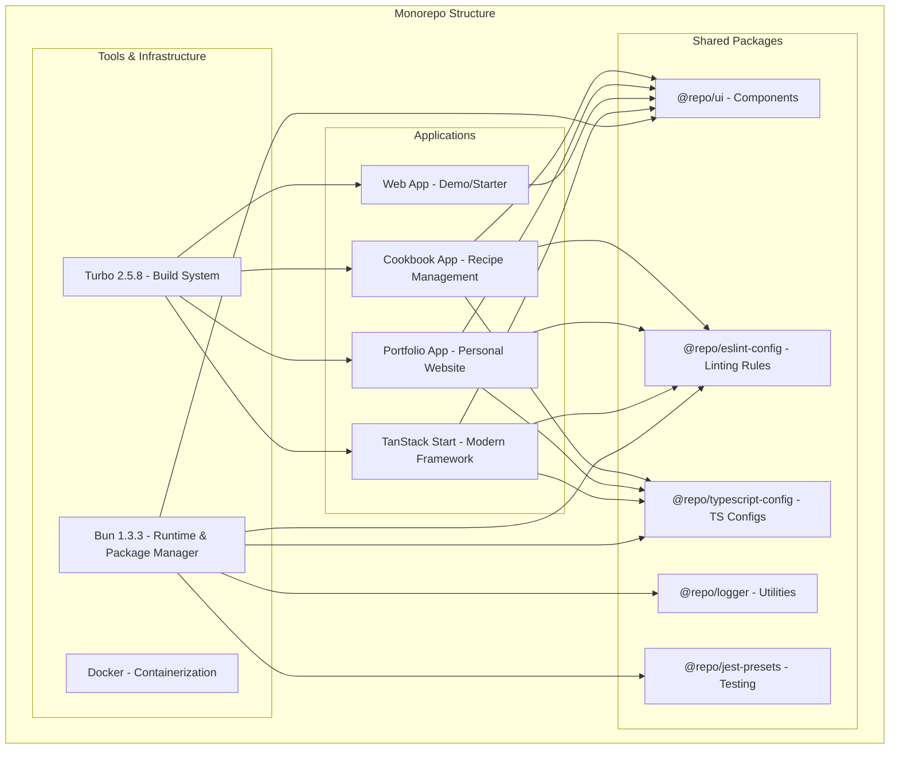

# Next.js Monorepo - Personal Projects Collection

[](https://nextjs.org/)
[](https://reactjs.org/)
[](https://www.typescriptlang.org/)
[](https://bun.sh/)
[](https://turbo.build/)
[](https://www.docker.com/)

A modern **monorepo** containing multiple Next.js applications built with the latest **React 19**, **Next.js 15**, and **Bun** runtime.

## Live Demos

- **Portfolio**: [hameldesai.com](https://hameldesai.com) *(Production Ready)*
- **Cookbook**: *Coming Soon* *(Active Development)*

---

## Architecture Overview



---

## Applications Deep Dive

### **Cookbook App** - Recipe Management Platform

> *A personal project built for my wife to manage and store her favorite recipes*

**Purpose**: Full-featured recipe management application with authentication, CRUD operations, and file uploads.

**Tech Stack**:
- **Framework**: Next.js 15.4.1 with App Router
- **Frontend**: React 19.2.0 with Server Components
- **Database**: Supabase (PostgreSQL + Auth)
- **UI Library**: Shadcn/ui + Radix UI components
- **Forms**: React Hook Form + Zod validation + useActionState
- **Styling**: Tailwind CSS 3.4.1
- **Icons**: Lucide React
- **Themes**: next-themes for dark/light mode

**Key Features**:
- **Authentication**: Supabase Auth with sign-up/sign-in
- **Recipe Storage**: MDX-based recipe format
- **File Uploads**: Image handling for recipes
- **CRUD Operations**: Add, edit, delete recipes *(In Progress)*
- **Search & Filter**: Recipe discovery *(Planned)*
- **Categories**: Recipe organization *(Planned)*

**Development Status**: Active Development

---

### **Portfolio App** - Personal Website

> *Professional portfolio showcasing my work experience and projects*

**Purpose**: Personal portfolio website featuring work experience, projects, and professional information.

**Tech Stack**:
- **Framework**: Next.js 15.4.1 with App Router
- **Frontend**: React 19.2.0 with Static Generation
- **Animations**: Framer Motion 12.23.24
- **Styling**: Tailwind CSS 4.1.11 (Latest!)
- **Typography**: @tailwindcss/typography
- **Content**: React Markdown for dynamic content
- **UI Components**: Radix UI + Custom components

**Key Features**:
- **Responsive Design**: Mobile-first approach
- **Work Experience**: Detailed career timeline
- **Project Showcase**: Featured projects and repositories
- **Smooth Animations**: Framer Motion interactions
- **Modern Typography**: Beautiful text rendering
- **Performance Optimized**: Static generation for speed

**Development Status**: Production Ready

---

### **TanStack Start App** - Modern Full-Stack Framework

---

## Shared Packages

### **@repo/ui** - Shared Component Library
Reusable React components used across all applications.
- **Button components** with consistent styling
- **Form elements** and input components
- **Layout components** for common patterns

### **@repo/eslint-config** - Linting Configuration
Centralized ESLint rules and configurations.
- **Next.js specific rules** for App Router
- **React 19 compatibility** rules
- **TypeScript integration** for type-aware linting
- **Prettier integration** for consistent formatting

### **@repo/typescript-config** - TypeScript Configurations
Shared TypeScript configurations for different project types.
- **Base configuration** for all projects
- **Next.js specific** settings
- **React library** configurations
- **Strict type checking** enabled

### **@repo/logger** - Logging Utilities
Isomorphic logging utilities for consistent logging across apps.
- **Console wrapper** with enhanced formatting
- **Environment-aware** logging levels
- **TypeScript support** for type-safe logging

### **@repo/jest-presets** - Testing Configuration
Jest configurations and presets for testing setup.
- **Node.js testing** configurations
- **React component** testing setup
- **TypeScript support** for test files

---

## Technology Stack Details

### **Frontend Stack**

#### **React 19.2.0** - Latest React Features
- **React Compiler**: Automatic memoization and optimization
- **useActionState**: New hook for server actions (replaces useFormState)
- **Server Components**: Enhanced server-side rendering
- **Improved Hydration**: Better error handling and performance
- **Concurrent Features**: Suspense, transitions, and streaming

#### **Next.js 15.4.1** - Full-Stack React Framework
- **App Router**: File-system based routing with layouts
- **Server Actions**: Type-safe server-side functions
- **React 19 Support**: Full compatibility with latest React features
- **Turbopack**: Faster development builds (when enabled)
- **Image Optimization**: Automatic image optimization and WebP conversion
- **Font Optimization**: Automatic font loading and optimization

#### **TypeScript 5.8.3** - Type Safety
- **Strict Mode**: Full type checking enabled
- **React 19 Types**: Latest type definitions for React features
- **Path Mapping**: Absolute imports with @ aliases
- **Incremental Compilation**: Faster builds with project references

### **UI & Styling Libraries**

#### **Tailwind CSS** - Utility-First Styling
- **Cookbook**: v3.4.1 with custom configurations
- **Portfolio**: v4.1.11 (Latest major version!)
- **Responsive Design**: Mobile-first approach
- **Dark Mode**: Built-in dark mode support
- **Custom Animations**: tailwindcss-animate for smooth transitions

#### **Radix UI** - Headless Component Primitives
- **Accessibility**: WAI-ARIA compliant components
- **Customizable**: Unstyled components for design flexibility
- **Components Used**:
  - `@radix-ui/react-dropdown-menu`: Navigation menus
  - `@radix-ui/react-checkbox`: Form inputs
  - `@radix-ui/react-label`: Form labels
  - `@radix-ui/react-slot`: Component composition
  - `@radix-ui/react-avatar`: User avatars

#### **Shadcn/ui** - Component System (Cookbook)
- **Copy-Paste Components**: No package dependency
- **Radix UI Based**: Built on top of Radix primitives
- **Tailwind Styled**: Pre-styled with Tailwind CSS
- **Customizable**: Easy to modify and extend

#### **Framer Motion** - Animation Library (Portfolio)
- **Smooth Animations**: 60fps animations
- **Gesture Support**: Drag, hover, tap interactions
- **Layout Animations**: Automatic layout transitions
- **Performance**: Hardware-accelerated animations

#### **Lucide React** - Icon Library
- **Consistent Icons**: Beautiful, consistent icon set
- **Tree Shakable**: Only import icons you use
- **Customizable**: Easy to style and resize
- **TypeScript**: Full TypeScript support

### **Form Handling & Validation**

#### **React Hook Form** - Client-Side Form Management
- **Performance**: Minimal re-renders with uncontrolled components
- **Validation**: Built-in validation rules
- **TypeScript**: Full type safety for form data
- **Developer Experience**: Simple API with powerful features

#### **Zod** - Schema Validation
- **Type-Safe**: TypeScript-first schema validation
- **Runtime Safety**: Validates data at runtime
- **Form Integration**: Perfect integration with React Hook Form
- **Error Messages**: Detailed validation error messages

#### **useActionState** - Server Actions (React 19)
- **Server Integration**: Direct connection to Next.js Server Actions
- **Loading States**: Automatic pending state management
- **Error Handling**: Built-in error state management
- **Progressive Enhancement**: Works without JavaScript

### **Backend & Database**

#### **Supabase** - Backend-as-a-Service
- **PostgreSQL**: Powerful relational database
- **Authentication**: Built-in user management and auth
- **Real-time**: Live data synchronization
- **Row Level Security**: Database-level security policies
- **Storage**: File upload and management
- **Edge Functions**: Serverless functions at the edge

#### **Server Actions** - Next.js Server-Side Logic
- **Type Safety**: Full TypeScript support
- **Direct Database Access**: No API routes needed
- **Form Integration**: Works seamlessly with forms
- **Caching**: Automatic caching and revalidation

---

## Getting Started

### **Prerequisites**

- **Bun**: 1.3.3 or later (replaces Node.js and package managers)
- **Docker**: For containerized development (optional)
- **Git**: For version control

### **Installation**

1. **Clone the repository**:
   ```bash
   git clone https://github.com/hd719/nextjs-monorepo.git
   cd nextjs-monorepo
   ```

2. **Install Bun** (if not already installed):
   ```bash
   # macOS/Linux
   curl -fsSL https://bun.sh/install | bash
   
   # Windows
   powershell -c "irm bun.sh/install.ps1 | iex"
   ```

3. **Install dependencies**:
   ```bash
   bun install
   ```

4. **Set up environment variables**:
   ```bash
   # Copy environment template for cookbook app
   cp apps/cookbook/.env.example apps/cookbook/.env.local

   # Add your Supabase credentials
   # NEXT_PUBLIC_SUPABASE_URL=your_supabase_url
   # NEXT_PUBLIC_SUPABASE_ANON_KEY=your_supabase_anon_key
   ```

### **Development**

#### **Run All Applications**:
```bash
bun run dev
```

#### **Run Individual Applications**:
```bash
# Cookbook app (http://localhost:3002)
bun run dev --filter=cookbook

# Portfolio app (http://localhost:3001)
bun run dev --filter=portfolio

# Web app (http://localhost:3000)
bun run dev --filter=web

# TanStack Start app (http://localhost:3003)
bun run dev --filter=tanstack-demo
```

#### **Build Applications**:
```bash
# Build all apps
bun run build

# Build specific app
bun run build --filter=cookbook
```

### **Environment Variables Setup**

#### **Cookbook App** (Supabase Integration):
Create `apps/cookbook/.env.local`:
```env
NEXT_PUBLIC_SUPABASE_URL=your_supabase_project_url
NEXT_PUBLIC_SUPABASE_ANON_KEY=your_supabase_anon_key
```

**Getting Supabase Credentials**:
1. Create account at [supabase.com](https://supabase.com)
2. Create new project
3. Go to Settings > API
4. Copy URL and anon key

---

## Development Workflow

### **Monorepo Commands**

#### **Turbo Scripts**:
```bash
# Development
bun run dev                    # Run all apps in development
bun run dev --filter=cookbook  # Run specific app

# Building
bun run build                  # Build all apps
bun run build --filter=web     # Build specific app

# Linting
bun run lint                   # Lint all packages
bun run lint --filter=portfolio # Lint specific app

# Cleaning
bun run clean                  # Clean all build artifacts
```

#### **Package Management**:
```bash
# Add dependency to specific app
bun add react-query --filter=cookbook

# Add dependency to workspace root
bun add -w turbo

# Add shared package to app
bun add @repo/ui --filter=portfolio

# Remove dependency
bun remove package-name --filter=cookbook
```

### **Docker Development**

#### **Build Docker Images**:
```bash
# Build all images with docker-compose
docker-compose build

# Or build individual images
docker build -f apps/web/Dockerfile -t nextjs-web:latest .
docker build -f Dockerfile.cookbook -t nextjs-cookbook:latest .
docker build -f Dockerfile.portfolio -t nextjs-portfolio:latest .
docker build -f Dockerfile.tanstack -t tanstack-start:latest .
```

> **Note**: All Docker images now use Bun as the runtime and package manager for faster builds and smaller image sizes.

#### **Run with Docker Compose**:
```bash
# Create network
docker network create app_network

# Start all services
docker-compose up -d

# View logs
docker-compose logs -f

# Stop services
docker-compose down
```

**Port Mapping**:
- **Web App**: http://localhost:3000
- **Portfolio**: http://localhost:3001  
- **Cookbook**: http://localhost:3002
- **TanStack Start**: http://localhost:3003

---

## Roadmap & Future Plans

### **Cookbook App Roadmap**

#### **Phase 1: Core CRUD** *(Current)*
- Authentication system
- Basic recipe structure
- Recipe creation and editing *(In Progress)*
- Recipe deletion and management *(In Progress)*
- Image upload for recipes *(In Progress)*

#### **Phase 2: Enhanced Features**
- Recipe categories and tags *(Planned)*
- Search and filtering *(Planned)*
- Recipe sharing functionality *(Planned)*
- Favorite recipes *(Planned)*
- Recipe ratings and reviews *(Planned)*

#### **Phase 3: Advanced Features**
- Meal planning *(Planned)*
- Shopping list generation *(Planned)*
- Nutritional information *(Planned)*
- Recipe scaling (serving size adjustment) *(Planned)*
- Print-friendly recipe format *(Planned)*

### **Infrastructure & DevOps**

#### **Deployment & Infrastructure**
- **Terraform**: Infrastructure as Code *(Planned)*
- **CI/CD Pipeline**: Automated deployments *(Planned)*
- **Monitoring**: Application and infrastructure monitoring *(Planned)*
- **Logging**: Centralized log management *(Planned)*

#### **Security & Performance**
- **TLS/HTTPS**: SSL certificate management *(Planned)*
- **SSH Hardening**: Secure server access *(Planned)*
- **Tailscale VPN**: Private network access *(Planned)*
- **Performance Monitoring**: Core Web Vitals tracking *(Planned)*

#### **Domain & Hosting**
- **Domain Management**: Porkbun DNS
- **VPS Deployment**: Hostinger/Hetzner setup *(Planned)*
- **Load Balancer**: Traefik reverse proxy *(Planned)*
- **Backup Strategy**: Automated backups *(Planned)*


---

## Connect & Learn More

- **Portfolio**: [hameldesai.com](https://hameldesai.com)
- **LinkedIn**: [Hamel Desai](https://linkedin.com/in/hameldesai)
- **GitHub**: [@hd719](https://github.com/hd719)
