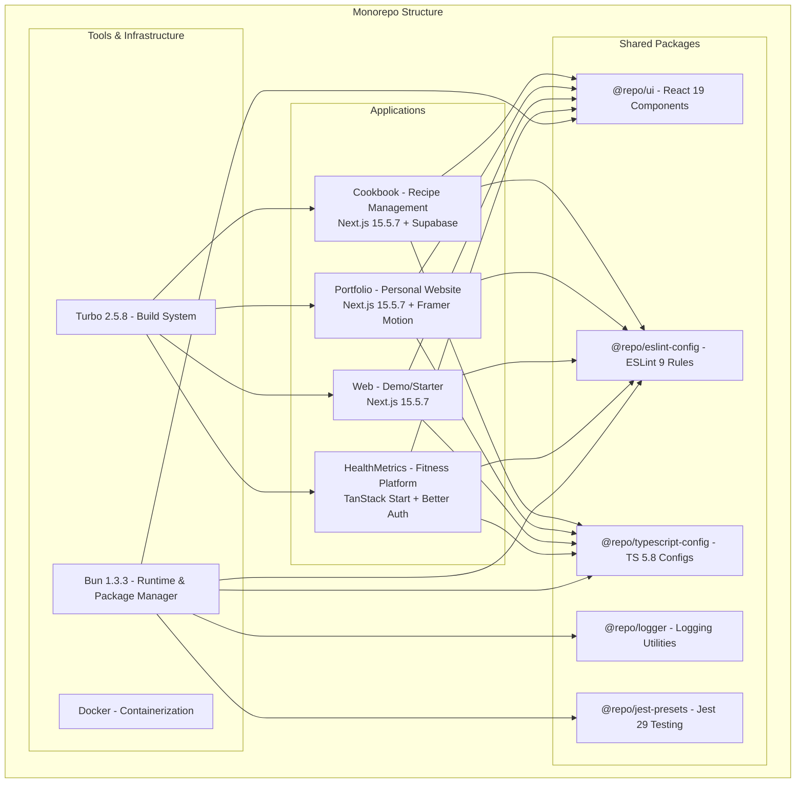

# Next.js Monorepo - Personal Projects Collection

[](https://nextjs.org/)
[](https://reactjs.org/)
[](https://www.typescriptlang.org/)
[](https://bun.sh/)
[](https://turbo.build/)
[](https://www.docker.com/)

A modern **monorepo** containing multiple Next.js and TanStack Start applications built with the latest **React 19**, **Next.js 15**, and **Bun** runtime.

## Live Demos

- **Portfolio**: [hameldesai.com](https://hameldesai.com) *(Production Ready)*
- **Cookbook**: *Coming Soon* *(Active Development)*
- **HealthMetrics**: *Coming Soon* *(Active Development)*

---

## Architecture Overview



---

## Applications Deep Dive

### **Cookbook App** - Recipe Management Platform

> *A personal project built for my wife to manage and store her favorite recipes*

**Purpose**: Full-featured recipe management application with authentication, CRUD operations, and file uploads.

**Tech Stack**:

- **Framework**: Next.js 15.5.7 with App Router
- **Frontend**: React 19.2.1 with Server Components
- **Database**: Supabase (PostgreSQL + Auth)
- **UI Library**: Shadcn/ui + Radix UI components
- **Forms**: React Hook Form + Zod validation + useActionState
- **Styling**: Tailwind CSS 3.4.1
- **Icons**: Lucide React
- **Themes**: next-themes for dark/light mode

**Key Features**:

- **Authentication**: Supabase Auth with sign-up/sign-in
- **Recipe Storage**: Database-backed recipe management
- **File Uploads**: Image handling for recipes
- **CRUD Operations**: Add, edit, delete recipes
- **Admin Panel**: Recipe management dashboard
- **Search & Filter**: Animated recipe search with filtering
- **Pagination**: Server-side pagination for recipes
- **SEO Optimized**: Sitemap, robots.txt, and meta tags

**Development Status**: Active Development

---

### **HealthMetrics App** - Fitness & Nutrition Platform

> *A comprehensive fitness and nutrition tracking platform built to learn TanStack Start*

**Purpose**: Full-featured fitness tracking application with nutrition logging, exercise tracking, weight management, and social features. Built as a learning project to master TanStack Start (modern full-stack React framework) while creating a MyFitnessPal-style platform.

**Tech Stack**:

- **Framework**: TanStack Start 1.143.11 (Full-Stack React)
- **Frontend**: React 19.2.1 with Server Components
- **Routing**: TanStack React Router (File-based)
- **Build Tool**: Vite 7.1.7
- **Database**: Prisma 7.2.0 with PostgreSQL (Prisma Postgres)
- **Authentication**: Better Auth 1.4.10 (NOT NextAuth)
- **UI Library**: Radix UI components
- **Forms**: TanStack React Form 1.0.0 + Zod 4 validation
- **Styling**: Tailwind CSS 4.0.6
- **Charts**: Recharts 3.6.0 for data visualization
- **Icons**: Lucide React
- **Testing**: Vitest 3.0.5 + React Testing Library
- **Themes**: Theme provider with dark/light mode

**Key Features**:

- **Authentication System**:
  - Email/password with Better Auth
  - Email verification flow
  - Password reset functionality
  - Session management with cookies
  - Protected routes with TanStack Router
  - Server-side authentication checks

- **Nutrition Tracking**:
  - Daily food diary with meal categorization
  - Barcode scanning integration *(Planned)*
  - Custom food creation
  - Recipe nutrition analysis *(Planned)*
  - Macro/micro nutrient tracking
  - Calorie counting and goals

- **Exercise & Fitness**:
  - Workout logging and history
  - Exercise database (cardio, strength, sports)
  - Calorie burn calculations
  - Activity level tracking
  - Custom exercise creation

- **Health Metrics**:
  - Weight tracking with trends
  - Body measurements
  - Progress photos *(Planned)*
  - Goal setting and milestones
  - Water intake tracking

- **Dashboard & Analytics**:
  - Daily nutrition summary
  - Exercise overview
  - Recent activity feed
  - Quick actions for logging
  - Progress visualization

- **Social Features** *(Planned)*:
  - Friend connections
  - Progress sharing
  - Community challenges
  - Motivation and support

**Architecture Highlights**:

- **File-Based Routing**: TanStack Router with nested layouts (`__root.tsx`, protected routes)
- **Server Functions**: Type-safe server operations with `createServerFn()`
- **Database Schema**: Comprehensive Prisma schema with:
  - Better Auth tables (user, session, account, verification)
  - App tables (users, food_items, diary_entries, exercises, weight_entries)
  - Social tables (friends, challenges)
  - Meal planning tables
- **Authentication Flow**:
  - Server-side session checks via `getRequestHeaders()`
  - Cookie-based sessions with Better Auth
  - Route protection with `beforeLoad` middleware
  - Separate auth and app user tables (clean separation of concerns)

**Learning Objectives**:

- Master TanStack Start's full-stack capabilities
- File-based routing with dynamic parameters
- Server functions and middleware patterns
- Advanced caching strategies
- Form handling with server actions
- Real-time features *(Future)*
- Performance optimization
- Error boundaries and loading states

**Development Status**: Active Development

---

### **Portfolio App** - Personal Website

> *Professional portfolio showcasing my work experience and projects*

**Purpose**: Personal portfolio website featuring work experience, projects, and professional information.

**Tech Stack**:

- **Framework**: Next.js 15.5.7 with App Router
- **Frontend**: React 19.1.2 with Static Generation
- **Animations**: Framer Motion 12.23.24
- **Styling**: Tailwind CSS 4.1.11 (Latest!)
- **Typography**: @tailwindcss/typography
- **Content**: React Markdown 10.1.0 for dynamic content
- **UI Components**: Radix UI + Custom components
- **Icons**: Lucide React

**Key Features**:

- **Responsive Design**: Mobile-first approach
- **Work Experience**: Detailed career timeline
- **Project Showcase**: Featured projects and repositories
- **Smooth Animations**: Framer Motion interactions
- **Modern Typography**: Beautiful text rendering
- **Performance Optimized**: Static generation for speed

**Development Status**: Production Ready

---

### **Web App** - Demo/Starter Application

> *A minimal Next.js starter template for quick prototyping*

**Purpose**: Lightweight demo application serving as a starter template for new Next.js projects within the monorepo.

**Tech Stack**:

- **Framework**: Next.js 15.5.7 with App Router
- **Frontend**: React 19.2.1
- **Styling**: Minimal setup (ready for customization)
- **UI**: Uses shared @repo/ui components

**Key Features**:

- **Minimal Setup**: Clean starting point for new apps
- **Shared Packages**: Demonstrates @repo/ui integration
- **Docker Ready**: Includes Dockerfile for containerization
- **TypeScript**: Full TypeScript 5.8.3 support

**Development Status**: Template/Starter

---

## Shared Packages

### **@repo/ui** - Shared Component Library

Reusable React 19 components used across all applications.

- **Button components** with consistent styling
- **React 19 Support**: Latest React version (19.2.0)
- **TypeScript**: Full TypeScript 5.8.3 support
- **Workspace Integration**: Used by Cookbook, Portfolio, and Web apps

### **@repo/eslint-config** - Linting Configuration

Centralized ESLint rules and configurations.

- **Next.js specific rules** for App Router
- **React 19 compatibility** rules
- **TypeScript integration** with @typescript-eslint/parser 8.15.0
- **Vercel Style Guide**: @vercel/style-guide 6.0.0
- **Turbo Support**: eslint-config-turbo 2.3.0
- **Prettier integration** for consistent formatting

### **@repo/typescript-config** - TypeScript Configurations

Shared TypeScript configurations for different project types.

- **Base configuration** for all projects
- **Next.js specific** settings
- **React library** configurations
- **Strict type checking** enabled

### **@repo/logger** - Logging Utilities

Isomorphic logging utilities for consistent logging across apps.

- **Console wrapper** with enhanced formatting
- **Environment-aware** logging levels
- **TypeScript support** for type-safe logging

### **@repo/jest-presets** - Testing Configuration

Jest configurations and presets for testing setup.

- **Node.js testing** configurations
- **React component** testing setup
- **TypeScript support** for test files

---

## Technology Stack Details

### **Frontend Stack**

#### **React 19.2.1** - Latest React Features

- **React Compiler**: Automatic memoization and optimization
- **useActionState**: New hook for server actions (replaces useFormState)
- **Server Components**: Enhanced server-side rendering
- **Improved Hydration**: Better error handling and performance
- **Concurrent Features**: Suspense, transitions, and streaming

#### **Next.js 15.5.7** - Full-Stack React Framework

- **App Router**: File-system based routing with layouts
- **Server Actions**: Type-safe server-side functions
- **React 19 Support**: Full compatibility with latest React features
- **Turbopack**: Faster development builds (when enabled)
- **Image Optimization**: Automatic image optimization and WebP conversion
- **Font Optimization**: Automatic font loading and optimization

#### **TypeScript 5.8.3** - Type Safety

- **Strict Mode**: Full type checking enabled
- **React 19 Types**: Latest type definitions for React features
- **Path Mapping**: Absolute imports with @ aliases
- **Incremental Compilation**: Faster builds with project references

#### **TanStack Start 1.143.11** - Full-Stack React Framework (HealthMetrics)

- **File-Based Routing**: Automatic route generation from file structure
- **Server Functions**: Type-safe server operations with `createServerFn()`
- **React Router Integration**: Built on TanStack React Router
- **SSR & Streaming**: Server-side rendering with streaming support
- **Middleware System**: Route-level and global middleware
- **Vite-Powered**: Fast development with Vite 7.1.7
- **Developer Tools**: Built-in devtools for routing and debugging
- **Type Safety**: Full TypeScript support throughout stack
- **React Query Integration**: TanStack React Query 5.62.0 for data fetching

### **Authentication & Backend**

#### **Better Auth 1.4.10** - Modern Authentication Framework (HealthMetrics)

- **Framework Agnostic**: Works with any framework (TanStack Start integration)
- **Email/Password**: Built-in email and password authentication
- **Email Verification**: Customizable email verification flow
- **Session Management**: Cookie-based sessions with caching
- **Password Reset**: Built-in password reset functionality
- **Database Adapters**: Prisma adapter for PostgreSQL
- **Type Safety**: Full TypeScript support
- **Security**: Automatic password hashing, CSRF protection
- **NOT NextAuth**: Completely different package with modern architecture

**Key Differences from NextAuth**:

- Better TypeScript integration
- Framework-agnostic design
- Simpler API surface
- Better Prisma integration
- Modern cookie handling
- Plugin system for extensions

#### **Prisma 7.2.0** - Next-Generation ORM (HealthMetrics)

- **Type-Safe Queries**: Auto-generated TypeScript types
- **Migrations**: Version-controlled database migrations
- **Multiple Databases**: PostgreSQL support with adapters
- **Prisma Postgres**: Managed PostgreSQL service option
- **Driver Adapters**: `@prisma/adapter-pg` for PostgreSQL
- **Schema Management**: Declarative schema with relations
- **Studio**: Visual database browser
- **Breaking Changes**: New config system with `prisma.config.ts`

### **UI & Styling Libraries**

#### **Tailwind CSS** - Utility-First Styling

- **Cookbook**: v3.4.1 with custom configurations
- **Portfolio**: v4.1.11 (Latest major version!)
- **HealthMetrics**: v4.0.6 with Vite plugin
- **Responsive Design**: Mobile-first approach
- **Dark Mode**: Built-in dark mode support
- **Custom Animations**: tailwindcss-animate for smooth transitions

#### **Radix UI** - Headless Component Primitives

- **Accessibility**: WAI-ARIA compliant components
- **Customizable**: Unstyled components for design flexibility
- **Components Used**:
  - `@radix-ui/react-dropdown-menu`: Navigation menus
  - `@radix-ui/react-checkbox`: Form inputs
  - `@radix-ui/react-label`: Form labels
  - `@radix-ui/react-slot`: Component composition
  - `@radix-ui/react-avatar`: User avatars

#### **Shadcn/ui** - Component System (Cookbook)

- **Copy-Paste Components**: No package dependency
- **Radix UI Based**: Built on top of Radix primitives
- **Tailwind Styled**: Pre-styled with Tailwind CSS
- **Customizable**: Easy to modify and extend

#### **Framer Motion** - Animation Library (Portfolio)

- **Smooth Animations**: 60fps animations
- **Gesture Support**: Drag, hover, tap interactions
- **Layout Animations**: Automatic layout transitions
- **Performance**: Hardware-accelerated animations

#### **Lucide React** - Icon Library

- **Consistent Icons**: Beautiful, consistent icon set
- **Tree Shakable**: Only import icons you use
- **Customizable**: Easy to style and resize
- **TypeScript**: Full TypeScript support
- **Latest Versions**: 0.436.0 (Cookbook) | 0.525.0 (Portfolio) | 0.544.0 (HealthMetrics)

#### **Recharts 3.6.0** - Charting Library (HealthMetrics)

- **React-Based**: Built specifically for React applications
- **Composable**: Flexible component-based API
- **Responsive**: Charts adapt to container size
- **Customizable**: Easy to style and configure
- **D3-Powered**: Built on D3.js for reliable calculations

### **Form Handling & Validation**

#### **React Hook Form** - Client-Side Form Management (Cookbook)

- **Performance**: Minimal re-renders with uncontrolled components
- **Validation**: Built-in validation rules
- **TypeScript**: Full type safety for form data
- **Developer Experience**: Simple API with powerful features

#### **TanStack React Form 1.0.0** - Advanced Form Management (HealthMetrics)

- **Stable Release**: Production-ready 1.0.0 version
- **Framework Agnostic**: Works with any React framework
- **Type Safety**: Full TypeScript support with type inference
- **Validation**: Built-in Zod adapter (`@tanstack/zod-form-adapter`)
- **Field Arrays**: Complex nested form structures
- **Performance**: Granular re-renders at field level
- **Server Actions**: Integration with TanStack Start server functions

#### **Zod** - Schema Validation

- **Type-Safe**: TypeScript-first schema validation
- **Runtime Safety**: Validates data at runtime
- **Form Integration**: Works with both React Hook Form and TanStack Form
- **Error Messages**: Detailed validation error messages
- **Composable**: Reusable validation schemas
- **Versions**: Zod 3.23.8 (Cookbook) | Zod 4.3.4 (HealthMetrics - latest!)

#### **useActionState** - Server Actions (React 19, Cookbook)

- **Server Integration**: Direct connection to Next.js Server Actions
- **Loading States**: Automatic pending state management
- **Error Handling**: Built-in error state management
- **Progressive Enhancement**: Works without JavaScript

### **Backend & Database Technologies**

#### **Supabase** - Backend-as-a-Service (Cookbook)

- **PostgreSQL**: Powerful relational database
- **Authentication**: Built-in user management and auth
- **Real-time**: Live data synchronization
- **Row Level Security**: Database-level security policies
- **Storage**: File upload and management
- **Edge Functions**: Serverless functions at the edge

#### **Prisma + PostgreSQL** - ORM + Database (HealthMetrics)

- **Type-Safe Database Client**: Auto-generated from schema
- **Migrations**: Version-controlled schema changes
- **Prisma Studio**: Visual database browser
- **Connection Pooling**: Efficient database connections
- **Better Auth Integration**: Prisma adapter for auth tables

#### **Server Actions & Functions**

- **Next.js Server Actions** (Cookbook): Type-safe server-side logic
- **TanStack Start Server Functions** (HealthMetrics): `createServerFn()` for type-safe operations
- **Direct Database Access**: No separate API layer needed
- **Form Integration**: Seamless form submission handling
- **Middleware Support**: Authentication and validation middleware

---

## Getting Started

### **Prerequisites**

- **Bun**: 1.3.3 or later (replaces Node.js and package managers)
- **Docker**: For containerized development (optional)
- **Git**: For version control

### **Installation**

1. **Clone the repository**:

   ```bash
   git clone https://github.com/hd719/nextjs-monorepo.git
   cd nextjs-monorepo
   ```

2. **Install Bun** (if not already installed):

   ```bash
   # macOS/Linux
   curl -fsSL https://bun.sh/install | bash

   # Windows
   powershell -c "irm bun.sh/install.ps1 | iex"
   ```

3. **Install dependencies**:

   ```bash
   bun install
   ```

4. **Set up environment variables**:

   ```bash
   # Copy environment template for cookbook app
   cp apps/cookbook/.env.example apps/cookbook/.env.local

   # Add your Supabase credentials
   # NEXT_PUBLIC_SUPABASE_URL=your_supabase_url
   # NEXT_PUBLIC_SUPABASE_ANON_KEY=your_supabase_anon_key
   ```

### **Development**

#### **Run All Applications**

```bash
bun run dev
```

#### **Run Individual Applications**

```bash
# Cookbook app (http://localhost:3002)
bun run dev --filter=cookbook

# Portfolio app (http://localhost:3001)
bun run dev --filter=portfolio

# Web app (http://localhost:3000)
bun run dev --filter=web

# HealthMetrics app (http://localhost:3003)
bun run dev --filter=healthmetrics
```

#### **Build Applications**

```bash
# Build all apps
bun run build

# Build specific app
bun run build --filter=cookbook
```

### **Environment Variables Setup**

#### **Cookbook App** (Supabase Integration)

Create `apps/cookbook/.env.local`:

```env
NEXT_PUBLIC_SUPABASE_URL=your_supabase_project_url
NEXT_PUBLIC_SUPABASE_ANON_KEY=your_supabase_anon_key
```

**Getting Supabase Credentials**:

1. Create account at [supabase.com](https://supabase.com)
2. Create new project
3. Go to Settings > API
4. Copy URL and anon key

#### **HealthMetrics App** (Prisma + Better Auth)

Create `apps/healthmetrics/.env.development.local`:

```env
# Database (Prisma Postgres)
DATABASE_URL=your_postgresql_connection_string

# Better Auth Configuration
BETTER_AUTH_URL=http://localhost:3003
APP_URL=http://localhost:3003
BETTER_AUTH_SECRET=your_secret_key_here

# API Keys (for nutrition data - optional)
USDA_API_KEY=your_usda_key
EDAMAM_APP_ID=your_edamam_id
EDAMAM_APP_KEY=your_edamam_key
```

**Getting Started**:

1. Set up PostgreSQL database (Prisma Postgres or local)
2. Generate secret: `openssl rand -base64 32`
3. Use 1Password CLI for secrets: `op run --env-file="./.env.development.local" -- bun prisma migrate dev`
4. Generate Prisma Client: `op run --env-file="./.env.development.local" -- bun prisma generate`

---

## Development Workflow

### **Monorepo Commands**

#### **Turbo Scripts**

```bash
# Development
bun run dev                    # Run all apps in development
bun run dev --filter=cookbook  # Run specific app

# Building
bun run build                  # Build all apps
bun run build --filter=web     # Build specific app

# Linting
bun run lint                   # Lint all packages
bun run lint --filter=portfolio # Lint specific app

# Cleaning
bun run clean                  # Clean all build artifacts
```

#### **Package Management**

```bash
# Add dependency to specific app
bun add react-query --filter=cookbook

# Add dependency to workspace root
bun add -w turbo

# Add shared package to app
bun add @repo/ui --filter=portfolio

# Remove dependency
bun remove package-name --filter=cookbook
```

### **Docker Development**

#### **Build Docker Images**

```bash
# Build all images with docker-compose
docker-compose build

# Or build individual images
docker build -f apps/web/Dockerfile -t nextjs-web:latest .
docker build -f Dockerfile.cookbook -t nextjs-cookbook:latest .
docker build -f Dockerfile.portfolio -t nextjs-portfolio:latest .
docker build -f Dockerfile.tanstack -t healthmetrics:latest .
```

> **Note**: All Docker images now use Bun as the runtime and package manager for faster builds and smaller image sizes.

#### **Run with Docker Compose**

```bash
# Create network
docker network create app_network

# Start all services
docker-compose up -d

# View logs
docker-compose logs -f

# Stop services
docker-compose down
```

**Port Mapping**:

- **Web App**: <http://localhost:3000>
- **Portfolio**: <http://localhost:3001>
- **Cookbook**: <http://localhost:3002>
- **HealthMetrics**: <http://localhost:3003>

---

## Roadmap & Future Plans

### **Cookbook App Roadmap**

#### **Phase 1: Core CRUD** *(Complete)*

- ✅ Authentication system (Supabase Auth)
- ✅ Basic recipe structure with database
- ✅ Recipe creation and editing
- ✅ Recipe deletion and management
- ✅ Image upload for recipes
- ✅ Admin panel for recipe management

#### **Phase 2: Enhanced Features** *(Current)*

- ✅ Animated search with filtering
- ✅ Server-side pagination
- ✅ SEO optimization (sitemap, robots.txt)
- Recipe categories and tags *(Planned)*
- Recipe sharing functionality *(Planned)*
- Favorite recipes *(Planned)*
- Recipe ratings and reviews *(Planned)*

#### **Phase 3: Advanced Features**

- Meal planning *(Planned)*
- Shopping list generation *(Planned)*
- Nutritional information *(Planned)*
- Recipe scaling (serving size adjustment) *(Planned)*
- Print-friendly recipe format *(Planned)*

### **HealthMetrics App Roadmap**

#### **Phase 1: Core Features & Authentication** *(Complete)*

- ✅ Better Auth integration with email/password
- ✅ Email verification flow
- ✅ Protected routes with TanStack Router
- ✅ User dashboard with daily summary
- ✅ Basic food diary structure
- ✅ Exercise tracking UI
- ✅ Water intake tracking
- ✅ Prisma schema with comprehensive models
- ✅ Onboarding flow with user profile setup
- ✅ Progress tracking and visualization
- ✅ Bundle optimization and performance
- Password reset functionality *(In Progress)*
- Profile management *(In Progress)*

#### **Phase 2: Nutrition Tracking**

- Food database integration (USDA API) *(Planned)*
- Meal logging with search *(Planned)*
- Barcode scanning *(Planned)*
- Custom food creation *(Planned)*
- Macro/micro nutrient tracking *(Planned)*
- Daily calorie goals *(Planned)*
- Nutrition analytics and trends *(Planned)*

#### **Phase 3: Exercise & Fitness**

- Exercise database setup *(Planned)*
- Workout logging *(Planned)*
- Calorie burn calculations *(Planned)*
- Activity level tracking *(Planned)*
- Exercise history and analytics *(Planned)*
- Custom exercise creation *(Planned)*

#### **Phase 4: Advanced Features**

- Weight tracking with graphs *(Planned)*
- Body measurements *(Planned)*
- Progress photos *(Planned)*
- Goal setting and milestones *(Planned)*
- Meal planning integration *(Planned)*
- Shopping list generation *(Planned)*

#### **Phase 5: Social & Community**

- Friend connections *(Planned)*
- Progress sharing *(Planned)*
- Community challenges *(Planned)*
- Activity feeds *(Planned)*
- Real-time features with Supabase *(Planned)*

#### **Phase 6: Cookbook Integration**

- Recipe nutrition API endpoints *(Planned)*
- One-click meal logging *(Planned)*
- Recipe sync and favorites *(Planned)*
- Cross-app authentication *(Planned)*

### **Infrastructure & DevOps**

#### **Deployment & Infrastructure**

- **Terraform**: Infrastructure as Code *(Planned)*
- **CI/CD Pipeline**: Automated deployments *(Planned)*
- **Monitoring**: Application and infrastructure monitoring *(Planned)*
- **Logging**: Centralized log management *(Planned)*

#### **Security & Performance**

- **TLS/HTTPS**: SSL certificate management *(Planned)*
- **SSH Hardening**: Secure server access *(Planned)*
- **Tailscale VPN**: Private network access *(Planned)*
- **Performance Monitoring**: Core Web Vitals tracking *(Planned)*

#### **Domain & Hosting**

- **Domain Management**: Porkbun DNS
- **VPS Deployment**: Hostinger/Hetzner setup *(Planned)*
- **Load Balancer**: Traefik reverse proxy *(Planned)*
- **Backup Strategy**: Automated backups *(Planned)*

---

## Key Technologies Comparison

### **Authentication Approaches**

| Feature | Cookbook (Next.js) | HealthMetrics (TanStack Start) |
|---------|-------------------|--------------------------------|
| **Auth Library** | Supabase Auth | Better Auth 1.4.10 |
| **Session Management** | JWT + Cookies | Cookie-based sessions |
| **Email Verification** | Built-in | Built-in with Better Auth |
| **Password Reset** | Built-in | Built-in with Better Auth |
| **Database** | Supabase PostgreSQL | Prisma 7.2 + PostgreSQL |
| **Social Login** | Supported | Configurable (plugins) |
| **Type Safety** | Good | Excellent |
| **Framework Lock-in** | Supabase ecosystem | Framework agnostic |

### **Framework Comparison**

| Aspect | Cookbook (Next.js 15.5) | HealthMetrics (TanStack Start 1.143) |
|--------|------------------------|--------------------------------------|
| **Routing** | App Router (file-based) | TanStack Router (file-based) |
| **Data Fetching** | Server Actions | Server Functions (`createServerFn()`) |
| **Forms** | React Hook Form 7.53 + useActionState | TanStack Form 1.0 + Server Functions |
| **Validation** | Zod 3 | Zod 4 |
| **State Management** | React 19 hooks | React 19 hooks + React Query 5 |
| **Authentication** | Supabase Auth | Better Auth 1.4.10 |
| **Database** | Supabase (Postgres) | Prisma 7.2 (Postgres) |
| **Middleware** | Next.js middleware | TanStack Router middleware |
| **Build Tool** | Next.js/Turbopack | Vite 7.1.7 |
| **Styling** | Tailwind CSS 3.4 | Tailwind CSS 4.0 |
| **Learning Curve** | Moderate | Steeper (newer framework) |
| **Flexibility** | High | Very High |

### **Why Two Apps?**

1. **Cookbook (Next.js)**:
   - Industry-standard framework
   - Production-ready patterns
   - Rich ecosystem
   - Easy deployment (Vercel)

2. **HealthMetrics (TanStack Start)**:
   - Learning cutting-edge technology
   - More granular control
   - Better TypeScript integration
   - Framework-agnostic patterns
   - Future-focused architecture

---

## Connect & Learn More

- **Portfolio**: [hameldesai.com](https://hameldesai.com)
- **LinkedIn**: [Hamel Desai](https://linkedin.com/in/hameldesai)
- **GitHub**: [@hd719](https://github.com/hd719)
